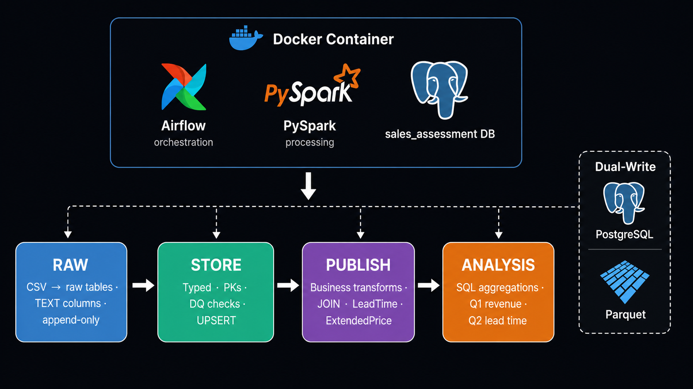
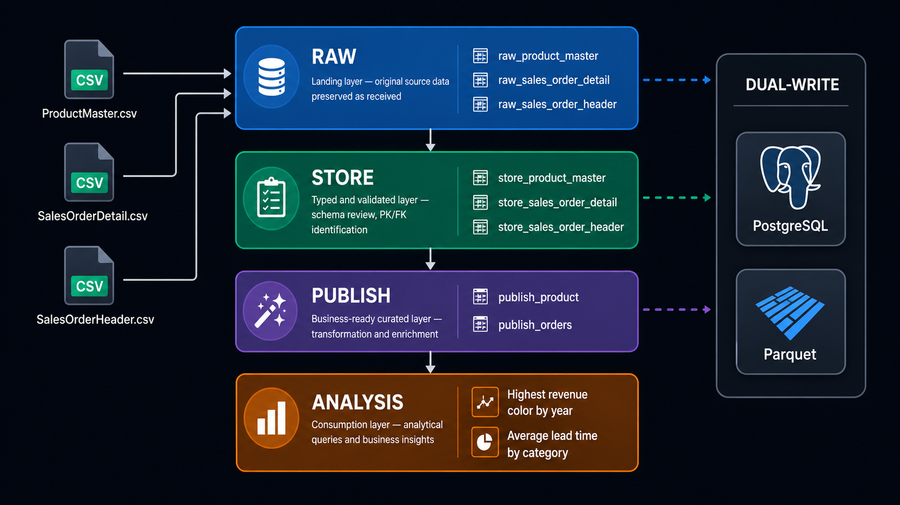
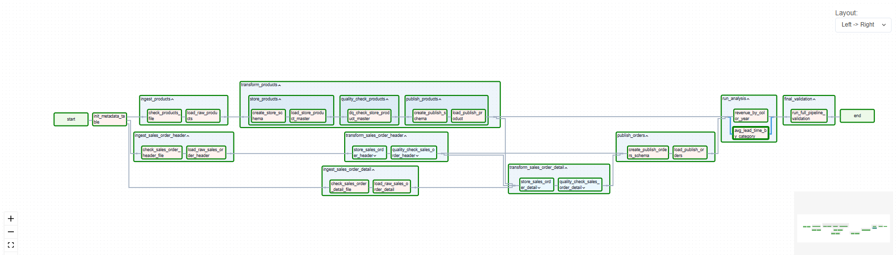
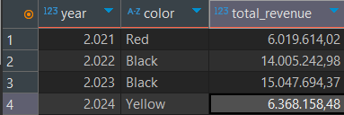
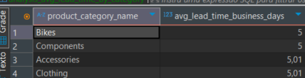
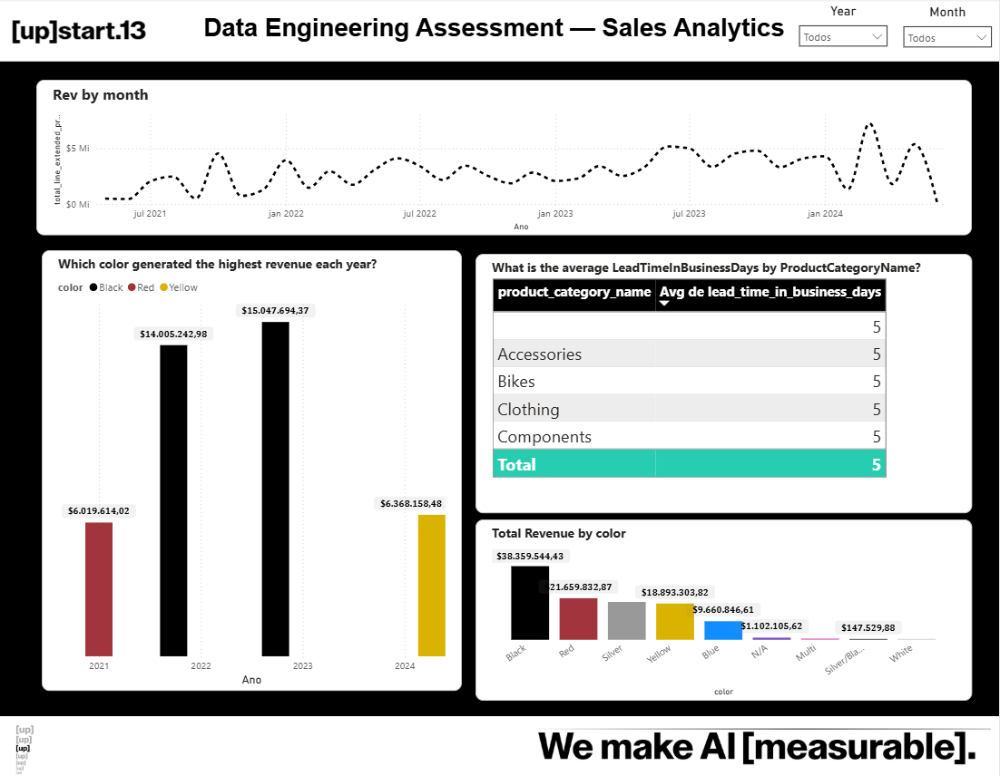

# Data Engineering Assessment

Sales data pipeline built with **PySpark**, **Apache Airflow**, and **PostgreSQL**, following a
raw → store → publish medallion architecture with dual-write to **Parquet** (lakehouse layer).

---

## Quick start

### Prerequisites
- [Docker Desktop](https://www.docker.com/products/docker-desktop/) running

### 1 — Place source files

```
data/input/products/            ← products.csv
data/input/sales_order_header/  ← sales_order_header.csv
data/input/sales_order_detail/  ← sales_order_detail.csv
```

### 2 — Start the stack

```bash
docker compose up --build
```

### 3 — Open Airflow UI

```
http://localhost:8080
Login: airflow / airflow
```

### 4 — Trigger the pipeline

Enable and trigger **`assessment_pipeline`**. The full run takes ~5–10 minutes.

### 5 — Connect to the database

```
Host:     localhost
Port:     5433
Database: sales_assessment
User:     assessment_user
Password: assessment_pass
```

---

## Architecture



The full solution runs via **Docker Compose** — Apache Airflow orchestrates the pipeline, PySpark processes the data, and a dedicated **PostgreSQL** database (`sales_assessment`) stores all layers.

The pipeline follows a **medallion architecture**: CSV files are ingested into a raw layer, typed and validated in a store layer, transformed into business-ready publish tables, and finally aggregated into analysis results.



Every layer also writes **Parquet files** to `data/lake/` in parallel — dual-write to both PostgreSQL and the lakehouse.

---

## DAG structure

- All three ingestions run in parallel
- `transform_detail` waits for **both** `transform_header` and `transform_products` — required by the two physical FKs declared on `store_sales_order_detail`
- Each `check_*` is a `ShortCircuitOperator` — skips downstream load if file is unchanged
- Transform tasks use `TriggerRule.NONE_FAILED` — run even when ingestion was skipped
- Final validation uses `TriggerRule.ALL_DONE` — always runs


---

## Tables

### Raw layer (TEXT columns, append-only)

| Table | Source | Rows |
|---|---|---|
| `raw_product_master` | products.csv | ~304 |
| `raw_sales_order_header` | sales_order_header.csv | ~31 466 |
| `raw_sales_order_detail` | sales_order_detail.csv | ~121 318 |

### Store layer (typed, PKs defined, UPSERT)

| Table | PK | Key decisions |
|---|---|---|
| `store_product_master` | `product_id` INTEGER | Deduplication applied (8 duplicate PKs in source) |
| `store_sales_order_header` | `sales_order_id` INTEGER | OrderDate partial format handled |
| `store_sales_order_detail` | `sales_order_detail_id` INTEGER | 2 negative qty rows kept (returns) |

### Publish layer (business-ready)

| Table | Rows | Description |
|---|---|---|
| `publish_product` | ~296 | Color NULL → `N/A`; CategoryName enriched from SubCategory |
| `publish_orders` | ~121 318 | JOIN detail+header; `LeadTimeInBusinessDays`; `TotalLineExtendedPrice` |

---

## Key data decisions

### Types
- All `*ID` columns → `INTEGER` (all values fit in 32-bit; numpy int32 handled by `_safe()`)
- `*Flag` columns → `BOOLEAN`
- `*Cost`, `*Price` columns → `DECIMAL(18,6)`
- `*Level`, `*Point` columns → `INTEGER`
- `Weight` → `FLOAT` (nullable)

### Foreign keys
Two FKs are enforced **physically** in `store_sales_order_detail`:
- `sales_order_id` → `store_sales_order_header` — detail row cannot exist without a matching header
- `product_id` → `store_product_master` — detail row cannot reference an unknown product

Both are declared inline in `CREATE TABLE`. The DAG makes `transform_detail` wait for both parent tables to be fully loaded before any detail row is inserted.

Two FKs remain **documented only** because the referenced tables are outside this dataset:
- `customer_id` → customer dimension (absent)
- `sales_person_id` → salesperson dimension (absent)

### OrderDate assumption
Only **5 rows (of 31,465)** store `OrderDate` as `"YYYY-MM"` (no day); the rest are full dates.
For those 5, `order_date = ship_date - 7 days` (length-based detection). Negligible analytical impact.

### Duplicate records
8 ProductIDs had 2 rows each (713–716, 881–884). One row per pair had empty
`ProductCategoryName` / `ProductSubCategoryName`. Decision: keep the row with fewest NULLs.
Generic function `deduplicate_by_completeness(df, pk_col)` applied — reusable for any table.

### Negative order quantities
2 detail rows have `order_qty = -1` (IDs 112 and 339). These are return/reversal entries.
Kept in the publish layer — `total_line_extended_price` is correctly negative (credit).

### INTEGER + psycopg2 (numpy int32 / NaN)
Two pandas/psycopg2 quirks are handled in `upsert_to_store()` via the `_safe()` helper:
1. numpy scalars (`int32`/`int64`) → converted to native Python `int` with `.item()`.
2. Nullable integer columns (e.g. `sales_person_id`) become `float64` with NULLs as
   `float('nan')` → converted to `None` (SQL NULL). This lets all IDs stay `INTEGER`.

---

## Analysis questions

**Q1 — Highest revenue color per year** → `publish_orders` JOIN `publish_product`, grouped by year and color



**Q2 — Average LeadTimeInBusinessDays by category** → `publish_orders` JOIN `publish_product`, grouped by product category



Results are stored in `analysis_revenue_by_color_year` and `analysis_avg_lead_time_by_category` and also printed in the Airflow task logs on every run.

---

## Power BI Dashboard

A Power BI report was built on top of the `publish_product` and `publish_orders` tables, connecting directly to the `sales_assessment` PostgreSQL database.



The report covers both analysis questions visually and is available at [`docs/dashboard/`](docs/dashboard/).

---

## Documentation

Full process documentation is available in [`docs/`](docs/):

| File | Contents |
|---|---|
| [`docs/data_model.md`](docs/data_model.md) | Type decision rules, column-by-column mapping for every table, FK relationships |
| [`docs/decisions_and_analysis.md`](docs/decisions_and_analysis.md) | Step-by-step record of every schema decision and DQ finding, with the exact SQL queries used |
| [`docs/dashboard/`](docs/dashboard/) | Power BI `.pbix` file connecting to `sales_assessment` |

---

## Project structure

```
.
├── dags/
│   └── assessment_pipeline_dag.py      # Single Airflow DAG — full pipeline wiring
├── data/
│   ├── input/                          # Source CSV files (place here before running)
│   └── lake/                           # Parquet output (raw / store / publish layers)
├── include/
│   ├── tasks/
│   │   ├── ingestion_tasks.py          # Raw load callables
│   │   ├── product_tasks.py            # Product store + publish callables
│   │   ├── sales_order_tasks.py        # Orders store + publish callables
│   │   ├── analysis_tasks.py           # Q1 + Q2 analysis callables
│   │   └── validation_tasks.py         # Full pipeline validation callable
│   └── utils/
│       ├── db_utils.py                 # PostgreSQL helpers + upsert_to_store()
│       ├── file_utils.py               # MD5 hash + file metadata
│       ├── spark_session.py            # Shared SparkSession builder
│       └── quality_utils.py            # DQ checks + deduplicate_by_completeness()
├── sql/
│   ├── raw/                            # CREATE TABLE raw_* (reference + raw_file_metadata)
│   ├── store/                          # CREATE TABLE IF NOT EXISTS store_* (with FK constraints)
│   ├── publish/                        # CREATE TABLE IF NOT EXISTS publish_*
│   ├── analysis/                       # CREATE TABLE AS SELECT (Q1 + Q2) + SELECT result files
│   └── validation/                     # One .sql file per validation check (orphans, DQ, business rules)
├── docs/                               # Full process documentation
├── docker-compose.yml
├── Dockerfile
└── requirements.txt
```

---

## Services

| Container | Purpose | Port |
|---|---|---|
| `postgres_assessment` | Pipeline data | 5433 |
| `postgres_airflow` | Airflow metadata | internal |
| `airflow_webserver` | Airflow UI | 8080 |
| `airflow_scheduler` | DAG execution | — |
